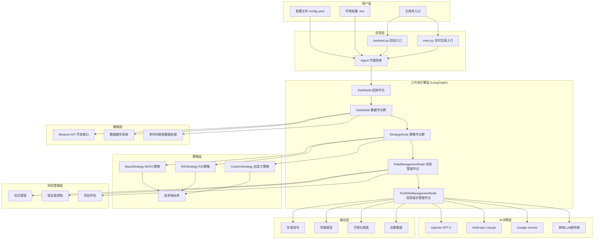
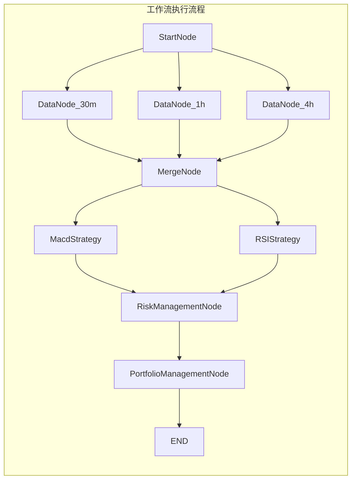
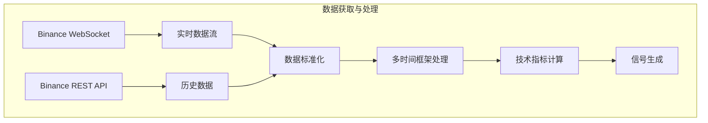
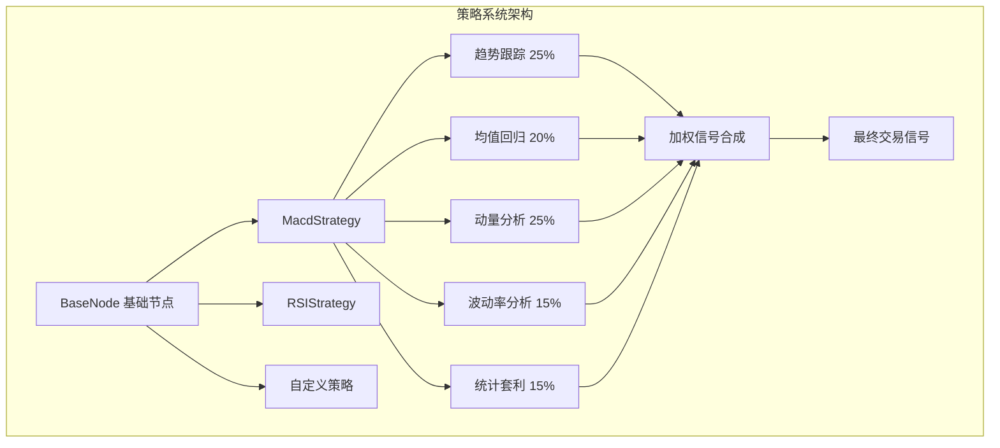

# AI Hedge Fund Crypto 架构框架与使用指南

## 项目概述

AI Hedge Fund Crypto 是一个基于人工智能的加密货币对冲基金交易系统，采用图工作流架构，结合多种技术分析策略和大语言模型进行智能交易决策。

## 系统架构图



## 核心架构组件

### 1. 工作流引擎架构



### 2. 数据流架构



### 3. 策略集成架构



## 技术架构详解

### 1. 核心技术栈

| 组件 | 技术选型 | 作用 |
|------|----------|------|
| 工作流引擎 | LangGraph | 构建有向无环图工作流 |
| AI推理 | LangChain + 多LLM | 智能决策和推理 |
| 数据处理 | Pandas + NumPy | 数据分析和计算 |
| 可视化 | Matplotlib | 图表生成 |
| 配置管理 | PyYAML + Pydantic | 配置文件管理 |
| 异步处理 | asyncio + aiohttp | 高性能数据获取 |

### 2. 设计模式

#### 策略模式 (Strategy Pattern)
```python
# 所有策略都实现BaseNode接口
class BaseNode:
    def __call__(self, state: AgentState) -> Dict[str, Any]:
        raise NotImplementedError

class MacdStrategy(BaseNode):
    def __call__(self, state: AgentState) -> Dict[str, Any]:
        # MACD策略实现
        pass
```

#### 状态模式 (State Pattern)
```python
# 使用TypedDict定义状态
class AgentState(TypedDict):
    messages: Annotated[List[BaseMessage], add_messages]
    data: Annotated[Dict[str, Any], deep_merge_dicts]
    metadata: Annotated[Dict[str, Any], deep_merge_dicts]
```

#### 工厂模式 (Factory Pattern)
```python
# 动态创建策略实例
def import_strategy_class(module_path: str):
    strategy_class = import_strategy_class(f"src.strategies.{strategy_name}")
    return strategy_class()
```

## 使用步骤和流程

### 第一步：环境准备

#### 1.1 系统要求
- Python 3.12+ (推荐)
- 8GB+ 内存
- 稳定的网络连接

#### 1.2 安装依赖
```bash
# 克隆项目
git clone https://github.com/51bitquant/ai-hedge-fund-crypto.git
cd ai-hedge-fund-crypto

# 创建虚拟环境
uv venv --python 3.12
source .venv/bin/activate  # Linux/Mac
# 或 .venv\Scripts\activate.bat  # Windows

# 安装依赖
uv pip sync
```

#### 1.3 配置API密钥
```bash
# 复制环境变量模板
cp .env.example .env

# 编辑.env文件，添加必要的API密钥
vim .env
```

```env
# Binance API (必需)
BINANCE_API_KEY=your_binance_api_key
BINANCE_API_SECRET=your_binance_secret

# LLM API密钥 (选择一个或多个)
OPENAI_API_KEY=your_openai_key
GROQ_API_KEY=your_groq_key
ANTHROPIC_API_KEY=your_anthropic_key
```

### 第二步：配置系统

#### 2.1 复制配置文件
```bash
cp config.example.yaml config.yaml
```

#### 2.2 编辑配置文件
```yaml
# 基础配置
mode: backtest  # backtest(回测) 或 live(实时)
start_date: 2025-01-01
end_date: 2025-02-01
primary_interval: 1h
initial_cash: 100000

# 信号配置
signals:
  intervals: ["30m", "1h", "4h"]  # 分析时间框架
  tickers: ["BTCUSDT", "ETHUSDT"]  # 交易对
  strategies: ['MacdStrategy']  # 使用的策略

# AI模型配置
model:
  name: "gpt-4o-mini"
  provider: "openai"
  # base_url: "https://api.openai.com/v1"  # 可选

# 显示配置
show_reasoning: false  # 是否显示AI推理过程
show_agent_graph: true  # 是否显示工作流图
```

### 第三步：运行系统

#### 3.1 回测模式
```bash
# 运行回测
uv run backtest.py

# 或者使用主程序
uv run main.py
```

#### 3.2 实时模式
```bash
# 修改config.yaml中的mode为live
mode: live

# 运行实时分析
uv run main.py
```

### 第四步：结果分析

#### 4.1 回测结果
系统会生成以下输出：
- 控制台性能指标
- 可视化图表 (保存在imgs/目录)
- 工作流图 (如果启用)

#### 4.2 实时交易信号
```json
{
  "decisions": {
    "BTCUSDT": {
      "action": "buy",
      "quantity": 0.1,
      "confidence": 75,
      "reasoning": "技术指标显示强烈买入信号..."
    }
  }
}
```

## 高级使用流程

### 自定义策略开发流程

#### 步骤1：创建策略文件
```python
# src/strategies/my_custom_strategy.py
from typing import Dict, Any
import pandas as pd
from src.graph import AgentState, BaseNode

class MyCustomStrategy(BaseNode):
    def __call__(self, state: AgentState) -> Dict[str, Any]:
        # 获取数据
        data = state.get("data", {})
        tickers = data.get("tickers", [])
        intervals = data.get("intervals", [])
        
        # 初始化分析结果
        technical_analysis = {}
        
        # 处理每个交易对和时间框架
        for ticker in tickers:
            technical_analysis[ticker] = {}
            for interval in intervals:
                df = data.get(f"{ticker}_{interval.value}", pd.DataFrame())
                
                # 实现自定义策略逻辑
                signal = self.analyze_data(df)
                
                technical_analysis[ticker][interval.value] = {
                    "signal": signal["direction"],
                    "confidence": signal["confidence"],
                    "strategy_signals": {
                        "my_custom_indicator": signal
                    }
                }
        
        # 更新状态
        state["data"]["analyst_signals"]["my_custom_agent"] = technical_analysis
        
        return {
            "messages": [HumanMessage(content=json.dumps(technical_analysis))],
            "data": data,
        }
    
    def analyze_data(self, df: pd.DataFrame) -> Dict:
        # 自定义分析逻辑
        if df.empty:
            return {"direction": "neutral", "confidence": 0}
        
        # 示例：简单移动平均策略
        df['sma_20'] = df['close'].rolling(20).mean()
        df['sma_50'] = df['close'].rolling(50).mean()
        
        if df['sma_20'].iloc[-1] > df['sma_50'].iloc[-1]:
            return {"direction": "bullish", "confidence": 70}
        else:
            return {"direction": "bearish", "confidence": 70}
```

#### 步骤2：注册策略
```python
# src/strategies/__init__.py
from .my_custom_strategy import MyCustomStrategy

__all__ = [
    "MacdStrategy",
    "RSIStrategy", 
    "MyCustomStrategy",  # 添加新策略
]
```

#### 步骤3：配置使用
```yaml
# config.yaml
signals:
  strategies: ['MyCustomStrategy']  # 使用自定义策略
```

### 多策略组合优化流程

#### 步骤1：策略权重配置
```python
# 在策略中定义权重
strategy_weights = {
    "trend": 0.30,
    "mean_reversion": 0.25,
    "momentum": 0.25,
    "volatility": 0.20,
}
```

#### 步骤2：信号合成
```python
combined_signal = weighted_signal_combination(
    {
        "trend": trend_signals,
        "mean_reversion": mean_reversion_signals,
        "momentum": momentum_signals,
        "volatility": volatility_signals,
    },
    strategy_weights,
)
```

#### 步骤3：回测验证
```bash
# 运行多策略回测
uv run backtest.py
```

## 系统监控和维护

### 日志监控
```python
# 启用详细日志
import logging
logging.basicConfig(level=logging.INFO)
```

### 性能监控
```python
# 监控关键指标
- 信号生成延迟
- API调用成功率
- 内存使用情况
- 策略执行时间
```

### 错误处理
```python
# 系统具备完善的错误处理机制
- API连接失败重试
- 数据异常处理
- 策略执行异常恢复
```

## 最佳实践建议

### 1. 策略开发
- 先在回测模式下充分验证策略
- 使用多个时间框架提高信号质量
- 合理设置策略权重

### 2. 风险管理
- 设置合理的仓位限制
- 监控最大回撤
- 定期评估策略表现

### 3. 系统运维
- 定期更新依赖包
- 监控API使用量
- 备份重要配置和数据

### 4. 性能优化
- 使用数据缓存减少API调用
- 合理设置分析时间间隔
- 优化策略计算复杂度

这个架构框架为加密货币算法交易提供了完整的解决方案，结合了现代AI技术和传统量化分析的优势，具有高度的可扩展性和灵活性。