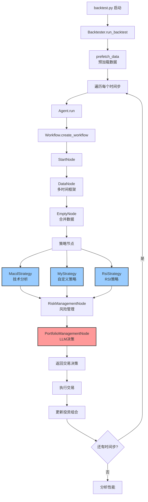
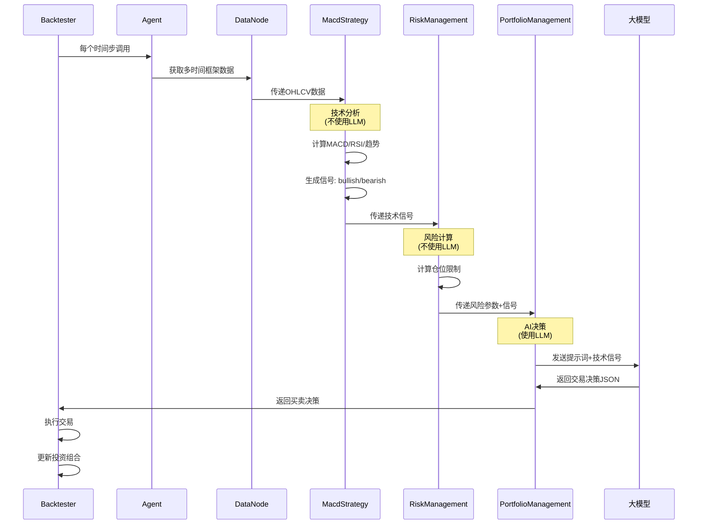

# AI对冲基金回测系统 - 代码阅读指南

## 📚 文档概述

本文档将帮助你系统性地理解和学习AI对冲基金回测系统的代码结构、工作原理，特别是策略如何使用大模型获取信号的完整流程。

## 🏗️ 系统架构分析

### 核心发现：混合型AI系统

**重要认知：这个系统实际上是"混合型AI系统"，不是纯粹的LLM驱动！**



### 🔍 信号获取方式分析

#### 1. 策略层（不使用LLM）
- **文件位置**：`src/strategies/` 目录下的所有策略
- **工作方式**：使用传统技术分析（MACD、RSI、移动平均等）
- **输出结果**：产生技术信号（bullish/bearish/neutral + 置信度）
- **特点**：纯算法计算，快速且确定性

#### 2. 决策层（使用LLM）
- **文件位置**：`src/graph/portfolio_management_node.py`
- **工作方式**：LLM作为"投资组合经理"角色
- **输入数据**：基于所有策略的技术信号
- **输出结果**：最终交易决策（买/卖/持有 + 数量）

## 🔄 信号流转过程详解



### 详细数据流转

1. **数据获取阶段**
   - `BinanceDataProvider` 获取历史数据（支持缓存）
   - `DataNode` 为每个时间框架准备数据
   - 数据格式：OHLCV + 时间戳

2. **技术分析阶段**
   - 各策略节点并行处理数据
   - 计算技术指标（MACD、RSI、布林带等）
   - 生成结构化信号

3. **风险管理阶段**
   - 计算仓位限制（每个资产最多20%仓位）
   - 检查可用现金和保证金
   - 设置最大可交易数量

4. **AI决策阶段**
   - 汇总所有技术信号
   - LLM分析信号并做出交易决策
   - 输出具体的买卖指令

5. **执行阶段**
   - `Backtester` 执行交易指令
   - 更新投资组合状态
   - 记录性能指标

## 🤖 LLM使用方式详解

### 📍 LLM调用位置

**唯一调用点**：`src/graph/portfolio_management_node.py` 第169-220行

### 📋 完整提示词分析

#### System Prompt（系统角色定义）
```
You are a portfolio manager making final trading decisions based on multiple tickers.

Trading Rules:
- For long positions:
  * Only buy if you have available cash
  * Only sell if you currently hold long shares of that ticker
  * Sell quantity must be ≤ current long position shares
  * Buy quantity must be ≤ max_shares for that ticker

- For short positions:
  * Only short if you have available margin (position value × margin requirement)
  * Only cover if you currently have short shares of that ticker
  * Cover quantity must be ≤ current short position shares
  * Short quantity must respect margin requirements

- The max_shares values are pre-calculated to respect position limits
- Consider both long and short opportunities based on signals
- Maintain appropriate risk management with both long and short exposure

Available Actions:
- "buy": Open or add to long position
- "sell": Close or reduce long position
- "short": Open or add to short position
- "cover": Close or reduce short position
- "hold": No action
```

#### Human Prompt（具体任务）
```
Based on the team's analysis, make your trading decisions for each ticker.

Here are the signals by ticker:
{signals_by_ticker}

Current Prices:
{current_prices}

Maximum Shares Allowed For Purchases:
{max_shares}

Portfolio Cash: {portfolio_cash}
Portfolio Positions: {portfolio_positions}
Current Margin Requirement: {margin_requirement}
Total Margin Used: {total_margin_used}

Output strictly in JSON with the following structure:
{
  "decisions": {
    "TICKER1": {
      "action": "buy/sell/short/cover/hold",
      "quantity": float,
      "confidence": float between 0 and 100,
      "reasoning": "string"
    }
  }
}
```

### 📊 输入数据结构示例

```json
{
  "signals_by_ticker": {
    "BTCUSDT": {
      "technical_analyst_agent": {
        "1h": {
          "signal": "bullish",
          "confidence": 75,
          "strategy_signals": {
            "trend_following": {
              "signal": "bullish", 
              "confidence": 80,
              "metrics": {"macd": 0.002, "signal_line": 0.001}
            },
            "mean_reversion": {
              "signal": "neutral",
              "confidence": 50,
              "metrics": {"bb_position": 0.3, "rsi": 45}
            },
            "momentum": {
              "signal": "bullish",
              "confidence": 85,
              "metrics": {"roc": 0.05, "stoch": 75}
            }
          }
        }
      }
    }
  },
  "current_prices": {"BTCUSDT": 45000.0},
  "max_shares": {"BTCUSDT": 0.5},
  "portfolio_cash": 10000.0
}
```

### 🎯 LLM输出格式

```json
{
  "decisions": {
    "BTCUSDT": {
      "action": "buy",
      "quantity": 0.2,
      "confidence": 80.0,
      "reasoning": "Strong bullish signals across timeframes with trend following and momentum alignment"
    },
    "ETHUSDT": {
      "action": "hold",
      "quantity": 0.0,
      "confidence": 55.0,
      "reasoning": "Mixed signals, waiting for clearer direction"
    }
  }
}
```

## 📖 代码阅读路线图

### 🎯 Phase 1: 理解入口和整体流程
```bash
1️⃣ backtest.py                    # 主入口，了解启动流程
2️⃣ src/backtest/backtester.py     # 回测引擎，核心循环逻辑
3️⃣ src/agent/agent.py             # 代理入口，工作流调用
4️⃣ src/agent/workflow.py          # 工作流定义，节点连接关系
```

### 🎯 Phase 2: 理解数据流和节点架构
```bash
5️⃣ src/graph/state.py             # 状态定义，数据传递机制
6️⃣ src/graph/base_node.py         # 基础节点类
7️⃣ src/graph/start_node.py        # 开始节点
8️⃣ src/graph/data_node.py         # 数据节点，多时间框架处理
```

### 🎯 Phase 3: 理解策略实现（技术分析）
```bash
9️⃣ src/strategies/macd_strategy.py    # MACD策略实现
🔟 src/strategies/my_strategy.py      # 自定义策略示例
1️⃣1️⃣ src/indicators/general_indicators.py  # 技术指标计算
```

### 🎯 Phase 4: 理解AI决策层
```bash
1️⃣2️⃣ src/graph/risk_management_node.py      # 风险管理逻辑
1️⃣3️⃣ src/graph/portfolio_management_node.py # AI决策核心 ⭐
1️⃣4️⃣ src/llm/__init__.py                   # LLM集成与缓存
```

### 🎯 Phase 5: 理解支撑系统
```bash
1️⃣5️⃣ src/utils/binance_data_provider.py    # 数据获取与缓存
1️⃣6️⃣ src/utils/settings.py                # 配置管理
1️⃣7️⃣ config.yaml                          # 配置文件
```

## 🔥 文件优先级指南

### 🔴 必读文件（核心逻辑）
- `src/agent/workflow.py` - 工作流定义，理解整体架构
- `src/graph/portfolio_management_node.py` - AI决策核心，唯一的LLM调用点
- `src/strategies/macd_strategy.py` - 策略实现示例
- `src/backtest/backtester.py` - 回测引擎，主循环逻辑

### 🟡 重要文件（理解机制）
- `src/graph/state.py` - 状态管理，数据如何在节点间传递
- `src/llm/__init__.py` - LLM集成，支持多个提供商
- `src/utils/binance_data_provider.py` - 数据获取与缓存机制

### 🟢 可选文件（深入理解）
- `src/indicators/general_indicators.py` - 技术指标实现细节
- `src/utils/settings.py` - 配置解析逻辑
- `src/graph/其他节点` - 辅助节点实现

## 💡 快速熟悉代码的建议

### 1️⃣ 从配置文件开始
```bash
# 查看系统配置，了解支持的功能
cat config.yaml

# 重点关注：
# - signals.strategies: 支持的策略
# - signals.intervals: 支持的时间框架  
# - model: LLM配置
# - tickers: 交易对配置
```

### 2️⃣ 运行一次回测
```bash
python backtest.py

# 观察控制台输出，理解：
# - 数据预加载过程
# - 每个时间步的处理流程
# - 技术信号生成
# - AI决策过程
# - 交易执行结果
```

### 3️⃣ 添加调试输出
```python
# 在关键节点添加打印语句

# src/graph/portfolio_management_node.py 第188行附近
print("🔍 LLM收到的信号:", json.dumps(signals_by_ticker, indent=2))

# src/strategies/macd_strategy.py 第70行附近  
print("📊 技术分析结果:", json.dumps(technical_analysis, indent=2))

# src/backtest/backtester.py 第330行附近
print("💰 交易决策:", decisions)
```

### 4️⃣ 理解关键概念

#### AgentState（全局状态）
```python
class AgentState(TypedDict):
    messages: List[BaseMessage]     # LangChain消息链
    data: Dict[str, Any]           # 市场数据、信号、投资组合状态
    metadata: Dict[str, Any]       # 元数据（模型配置等）
```

#### 信号传递流程
1. **策略生成** → `data["analyst_signals"]["technical_analyst_agent"]`
2. **风险管理** → `data["analyst_signals"]["risk_management_agent"]`
3. **AI决策** → LLM基于所有信号生成最终交易指令

#### 数据存储格式
```python
# 价格数据：data[f"{ticker}_{interval}"] = DataFrame
data["BTCUSDT_1h"] = pd.DataFrame(columns=['open', 'high', 'low', 'close', 'volume'])

# 技术信号：data["analyst_signals"][agent_name][ticker][interval]
data["analyst_signals"]["technical_analyst_agent"]["BTCUSDT"]["1h"] = {
    "signal": "bullish",
    "confidence": 75
}
```

## 🚀 性能优化特性

### 📦 数据缓存
- **位置**：`cache/` 目录
- **格式**：`{symbol}_{timeframe}_{start_date}_{end_date}.csv`
- **逻辑**：自动检测缓存，避免重复API调用

### 🧠 LLM缓存
- **响应缓存**：相同输入返回缓存结果
- **决策复用**：信号变化不大时复用上次决策
- **错误处理**：失败时自动重试，最终fallback到hold策略

### ⚡ 并行处理
- **策略并行**：多个策略节点同时处理数据
- **时间框架并行**：不同时间框架的数据并行获取

## 🔧 实践建议

### 1. 修改策略实验
```python
# 从简单的 MyStrategy 开始
# src/strategies/my_strategy.py

# 添加新的技术指标
df['rsi'] = calculate_rsi(df['close'], period=14)
if df['rsi'].iloc[-1] > 70:
    signal = "bearish"
elif df['rsi'].iloc[-1] < 30:
    signal = "bullish"
```

### 2. 调整LLM提示词
```python
# src/graph/portfolio_management_node.py
# 在system prompt中添加你的交易偏好

system_prompt = """You are a conservative portfolio manager...
Additional rules:
- Prefer smaller position sizes during high volatility
- Never risk more than 5% on a single trade
- Consider correlation between assets
"""
```

### 3. 实验不同模型
```yaml
# config.yaml
model:
  provider: "dashscope"  # 尝试不同提供商
  name: "qwen-plus"      # 尝试不同模型
  base_url: "https://dashscope.aliyuncs.com/compatible-mode/v1"
```

### 4. 添加新的技术指标
```python
# src/indicators/general_indicators.py
def calculate_custom_indicator(df):
    # 实现你的自定义指标
    return {"signal": signal, "confidence": confidence}
```

## 🎯 关键理解要点

### 1. 架构优势
- **传统技术分析 + AI决策**：既保证指标准确性，又利用LLM决策能力
- **模块化设计**：策略、风险管理、决策分离，易于扩展
- **多时间框架**：同时考虑短期和长期信号

### 2. 数据流特点
- **状态驱动**：所有数据通过 `AgentState` 传递
- **LangGraph执行**：基于有向图的工作流引擎
- **缓存优化**：多层缓存提升性能

### 3. AI应用方式
- **不是完全AI**：技术分析仍使用传统算法
- **AI作为最终决策者**：整合所有信息做交易决策
- **可解释性**：LLM需要提供决策reasoning

## 📚 扩展学习资源

### 相关技术栈
- **LangGraph**：工作流编排框架
- **LangChain**：LLM应用开发框架
- **Pandas**：数据处理和技术指标计算
- **Binance API**：加密货币数据获取

### 建议学习顺序
1. 理解技术分析基础（MACD、RSI、布林带等）
2. 学习LangGraph工作流概念
3. 熟悉LLM提示词工程
4. 掌握量化交易基础知识
5. 了解风险管理原理

## 🔚 总结

这个系统展示了如何将传统量化交易与现代AI技术相结合：

- **稳定性**：传统技术指标提供可靠的市场信号
- **智能性**：LLM整合复杂信息做出最终决策  
- **可扩展性**：模块化设计便于添加新策略和指标
- **实用性**：完整的回测框架支持策略验证

通过系统学习这个代码库，你将掌握现代AI量化交易系统的核心设计理念和实现技巧！ 