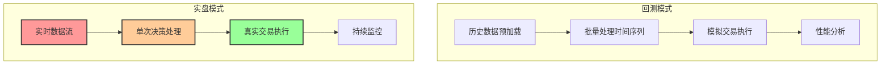
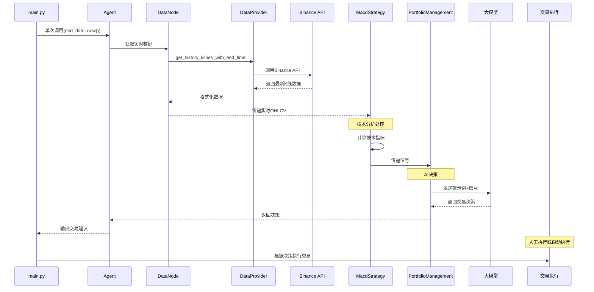
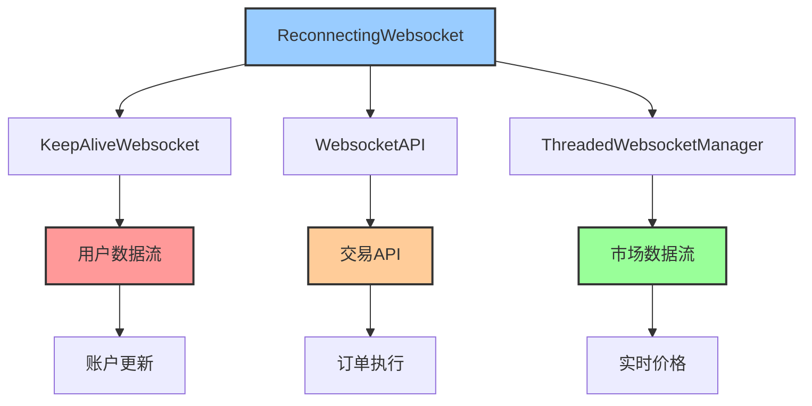

# AI对冲基金实盘交易系统 - 代码阅读指南

## 📚 文档概述

本文档将帮助你深入理解AI对冲基金实盘交易系统的代码架构、工作原理，特别是实时数据获取、信号生成和交易执行的完整流程。

## 🏗️ 实盘vs回测 架构对比

### 核心差异分析



### 🔍 实盘模式特点

#### 1. **数据获取方式**
- **回测**：预加载历史数据，批量处理
- **实盘**：实时获取最新数据，即时处理

#### 2. **执行频率**
- **回测**：遍历历史时间点，快速处理
- **实盘**：根据配置间隔（如30分钟）定期执行

#### 3. **交易执行**
- **回测**：模拟交易，更新虚拟投资组合
- **实盘**：发送真实交易指令到交易所

#### 4. **风险管理**
- **回测**：事后分析，无真实风险
- **实盘**：实时风险控制，真金白银

## 🔄 实盘交易流程详解



## 🚀 实盘模式启动方式

### 📍 配置文件设置

```yaml
# config.yaml
mode: live                    # 设置为实盘模式
primary_interval: 30m         # 主要时间框架
initial_cash: 10000          # 初始资金
signals:
  intervals: ["30m", "1h", "4h"]  # 多时间框架分析
  tickers: ["BTCUSDT", "ETHUSDT"] # 交易对
  strategies: ['MacdStrategy']     # 策略配置

# API配置（.env文件）
BINANCE_API_KEY=your_api_key
BINANCE_API_SECRET=your_api_secret
```

### 🎯 启动命令

```bash
# 修改config.yaml中mode为live
python main.py

# 输出示例：
# {'BTCUSDT': {'action': 'buy', 'quantity': 0.1, 'confidence': 75.0}}
```

## 📊 实时数据获取机制

### 🔍 数据获取流程

#### 1. **DataNode实时数据获取**
```python
# src/graph/data_node.py (第35-42行)
end_time = data.get('end_date', datetime.now()) + timedelta(milliseconds=500)

for ticker in tickers:
    df = data_provider.get_history_klines_with_end_time(
        symbol=ticker, 
        timeframe=timeframe, 
        end_time=end_time
    )
```

#### 2. **BinanceDataProvider核心方法**
```python
# src/utils/binance_data_provider.py

def get_history_klines_with_end_time(self, symbol, timeframe, end_time, limit=500):
    """获取截止到指定时间的历史数据"""
    klines = self.client.futures_historical_klines_with_end_time(
        symbol=formatted_symbol,
        interval=timeframe,
        end_str=end_time.strftime("%Y-%m-%d %H:%M:%S"),
        limit=limit
    )
```

#### 3. **数据缓存策略**
- **实盘模式**：通常不使用缓存（use_cache=False）
- **最新数据**：每次都获取最新的市场数据
- **时间窗口**：获取最近500根K线用于技术分析

### 📈 支持的数据类型

1. **现货数据**：通过标准Binance API
2. **期货数据**：通过futures_historical_klines_with_end_time
3. **多时间框架**：同时获取多个时间间隔的数据
4. **实时价格**：最新的OHLCV数据

## 🌐 WebSocket实时流集成

### 📡 WebSocket架构

项目包含完整的WebSocket基础设施，支持实时数据流：



### 🔧 WebSocket核心组件

#### 1. **ReconnectingWebsocket** (`src/gateway/binance/ws/reconnecting_websocket.py`)
- 自动重连机制
- 连接状态管理
- 错误处理和恢复

#### 2. **KeepAliveWebsocket** (`src/gateway/binance/ws/keepalive_websocket.py`)
- 保持连接活跃
- Listen Key管理
- 用户数据流维护

#### 3. **ThreadedWebsocketManager** (`src/gateway/binance/ws/threaded_stream.py`)
- 多线程WebSocket管理
- 并发数据流处理
- 线程安全操作

#### 4. **Streams** (`src/gateway/binance/ws/streams.py`)
- 市场数据流订阅
- K线数据流
- 深度数据流
- 交易数据流

### 💡 WebSocket使用示例

```python
# 实时K线数据流
from src.gateway.binance import ThreadedWebsocketManager

def handle_kline_message(msg):
    """处理实时K线数据"""
    symbol = msg['s']
    kline = msg['k']
    if kline['x']:  # K线已关闭
        # 处理完成的K线数据
        process_completed_kline(kline)

# 启动WebSocket管理器
twm = ThreadedWebsocketManager()
twm.start()
twm.start_kline_socket(callback=handle_kline_message, symbol='BTCUSDT')
```

## 🤖 实盘AI决策流程

### 🧠 决策生成过程

实盘模式使用与回测相同的AI决策逻辑，但有以下差异：

#### 1. **实时性要求**
- 数据获取：必须是最新的市场数据
- 决策速度：需要在秒级内完成分析
- 信号延迟：最小化从数据到决策的延迟

#### 2. **风险控制**
```python
# main.py 实盘模式投资组合初始化
portfolio = {
    "cash": settings.initial_cash,
    "margin_requirement": settings.margin_requirement,
    "margin_used": 0.0,
    "positions": {
        ticker: {
            "long": 0.0,
            "short": 0.0,
            "long_cost_basis": 0.0,
            "short_cost_basis": 0.0,
            "short_margin_used": 0.0
        }
        for ticker in settings.signals.tickers
    },
    "realized_gains": {
        ticker: {
            "long": 0.0,
            "short": 0.0,
        }
        for ticker in settings.signals.tickers
    },
}
```

#### 3. **决策输出格式**
```json
{
  "BTCUSDT": {
    "action": "buy",
    "quantity": 0.1,
    "confidence": 75.0,
    "reasoning": "Strong bullish signals across timeframes"
  },
  "ETHUSDT": {
    "action": "hold",
    "quantity": 0.0,
    "confidence": 55.0,
    "reasoning": "Mixed signals, waiting for clearer direction"
  }
}
```

### ⚡ 性能优化

#### 1. **LLM缓存机制**
- 响应缓存：相同市场条件下复用决策
- 信号变化检测：只在信号显著变化时调用LLM
- 错误fallback：LLM失败时使用默认策略

#### 2. **数据处理优化**
- 增量更新：只处理新增的K线数据
- 内存管理：定期清理旧数据
- 并行处理：多个时间框架数据并行获取

## 📋 代码阅读路线图

### 🎯 Phase 1: 理解实盘入口和配置
```bash
1️⃣ main.py                         # 实盘模式入口，理解启动逻辑
2️⃣ config.yaml                     # 实盘配置，模式切换
3️⃣ src/utils/settings.py           # 配置解析，环境变量处理
```

### 🎯 Phase 2: 理解实时数据获取
```bash
4️⃣ src/graph/data_node.py                    # 实时数据节点
5️⃣ src/utils/binance_data_provider.py       # 数据提供者核心
6️⃣ src/gateway/binance/client.py            # Binance客户端
```

### 🎯 Phase 3: 理解WebSocket实时流
```bash
7️⃣ src/gateway/binance/ws/reconnecting_websocket.py  # WebSocket基础
8️⃣ src/gateway/binance/ws/streams.py                 # 数据流管理
9️⃣ src/gateway/binance/ws/threaded_stream.py         # 多线程管理
```

### 🎯 Phase 4: 理解策略和决策（同回测）
```bash
🔟 src/strategies/macd_strategy.py            # 策略实现
1️⃣1️⃣ src/graph/portfolio_management_node.py  # AI决策核心
1️⃣2️⃣ src/llm/__init__.py                     # LLM集成
```

### 🎯 Phase 5: 理解交易执行和监控
```bash
1️⃣3️⃣ src/gateway/binance/client.py (交易方法)  # 订单执行
1️⃣4️⃣ src/gateway/binance/exceptions.py        # 异常处理
1️⃣5️⃣ .env.example                            # 环境配置
```

## 🔥 文件优先级指南

### 🔴 必读文件（实盘核心）
- `main.py` - 实盘模式入口，理解启动流程
- `src/graph/data_node.py` - 实时数据获取核心
- `src/utils/binance_data_provider.py` - 数据提供者实现
- `src/gateway/binance/client.py` - Binance API客户端

### 🟡 重要文件（实时机制）
- `src/gateway/binance/ws/` - WebSocket实时流基础设施
- `src/utils/settings.py` - 配置管理和环境变量
- `config.yaml` - 实盘运行配置

### 🟢 可选文件（深入理解）
- `src/gateway/binance/exceptions.py` - 异常处理
- `src/gateway/binance/helpers.py` - 辅助函数
- WebSocket高级特性文件

## 💡 实盘部署建议

### 1️⃣ 开发环境测试

```bash
# 1. 配置测试环境
cp config.example.yaml config.yaml
# 修改为测试配置

# 2. 设置环境变量
cp .env.example .env
# 填入测试账户API密钥

# 3. 运行信号生成模式
mode: live
python main.py
```

### 2️⃣ 生产环境部署

```python
# 添加交易执行逻辑
def execute_trading_decisions(decisions):
    """执行AI生成的交易决策"""
    for ticker, decision in decisions.items():
        action = decision['action']
        quantity = decision['quantity']
        confidence = decision['confidence']
        
        if confidence > 70 and quantity > 0:  # 高置信度才执行
            if action == 'buy':
                # 执行买入订单
                execute_buy_order(ticker, quantity)
            elif action == 'sell':
                # 执行卖出订单
                execute_sell_order(ticker, quantity)
```

### 3️⃣ 风险控制机制

```python
# 实盘风险控制
class RiskManager:
    def __init__(self, max_position_size=0.1, max_daily_loss=0.05):
        self.max_position_size = max_position_size  # 单个资产最大仓位10%
        self.max_daily_loss = max_daily_loss        # 日最大亏损5%
    
    def validate_order(self, ticker, action, quantity, current_portfolio):
        """验证订单是否符合风险控制"""
        # 检查仓位限制
        # 检查资金充足性
        # 检查日内亏损限制
        return True  # 或 False
```

### 4️⃣ 监控和日志

```python
# 添加详细日志
import logging

logging.basicConfig(
    level=logging.INFO,
    format='%(asctime)s - %(levelname)s - %(message)s',
    handlers=[
        logging.FileHandler('trading.log'),
        logging.StreamHandler()
    ]
)

# 在关键节点添加日志
logging.info(f"AI Decision: {decisions}")
logging.warning(f"High volatility detected: {volatility}")
logging.error(f"Order execution failed: {error}")
```

## 🔧 实盘优化特性

### 📈 性能优化

#### 1. **数据获取优化**
```python
# 批量获取多个交易对数据
async def get_multiple_tickers_data(tickers, timeframes):
    """异步批量获取数据"""
    tasks = []
    for ticker in tickers:
        for timeframe in timeframes:
            task = get_ticker_data_async(ticker, timeframe)
            tasks.append(task)
    
    results = await asyncio.gather(*tasks)
    return organize_results(results)
```

#### 2. **决策缓存策略**
```python
# 实盘决策缓存
class LiveTradingCache:
    def __init__(self, cache_duration=300):  # 5分钟缓存
        self.cache_duration = cache_duration
        self.decision_cache = {}
    
    def get_cached_decision(self, market_state_hash):
        """获取缓存的决策"""
        if market_state_hash in self.decision_cache:
            cached_time, decision = self.decision_cache[market_state_hash]
            if time.time() - cached_time < self.cache_duration:
                return decision
        return None
```

### 🛡️ 错误处理和恢复

#### 1. **网络连接恢复**
```python
# 网络中断恢复机制
def resilient_data_fetch(ticker, timeframe, max_retries=3):
    """具有重试机制的数据获取"""
    for attempt in range(max_retries):
        try:
            return data_provider.get_latest_data(ticker, timeframe)
        except Exception as e:
            logging.warning(f"Data fetch attempt {attempt + 1} failed: {e}")
            if attempt == max_retries - 1:
                # 使用备用数据源或返回缓存数据
                return get_fallback_data(ticker, timeframe)
            time.sleep(2 ** attempt)  # 指数退避
```

#### 2. **API限制处理**
```python
# API限制和速率控制
class RateLimitManager:
    def __init__(self, requests_per_minute=1200):
        self.requests_per_minute = requests_per_minute
        self.request_times = []
    
    def can_make_request(self):
        """检查是否可以发起请求"""
        now = time.time()
        # 清理1分钟前的请求记录
        self.request_times = [t for t in self.request_times if now - t < 60]
        return len(self.request_times) < self.requests_per_minute
```

## 🚨 实盘交易注意事项

### ⚠️ 安全提醒

#### 1. **API密钥安全**
```bash
# 环境变量配置
# .env文件
BINANCE_API_KEY=your_read_only_or_limited_key
BINANCE_API_SECRET=your_secret

# 权限设置建议：
# - 现货交易：启用
# - 期货交易：谨慎启用  
# - 提币权限：禁用
# - IP白名单：启用
```

#### 2. **资金管理**
```python
# 资金安全设置
SAFETY_SETTINGS = {
    "max_single_trade_ratio": 0.02,    # 单笔交易最多2%资金
    "max_total_exposure": 0.20,        # 总敞口最多20%
    "emergency_stop_loss": 0.10,       # 紧急止损10%
    "max_concurrent_positions": 5,     # 最多5个并发持仓
}
```

#### 3. **监控告警**
```python
# 异常情况告警
def check_trading_anomalies(portfolio, decisions):
    """检查交易异常"""
    alerts = []
    
    # 检查大额交易
    for ticker, decision in decisions.items():
        if decision['quantity'] * get_price(ticker) > 1000:  # 超过1000美元
            alerts.append(f"Large trade detected: {ticker} {decision}")
    
    # 检查快速连续交易
    if len(decisions) > 3:
        alerts.append("Multiple simultaneous trades detected")
    
    return alerts
```

### 📊 监控指标

#### 1. **系统性能监控**
- 数据获取延迟
- 决策生成时间
- API调用成功率
- 内存和CPU使用率

#### 2. **交易性能监控**
- 信号准确率
- 实际执行价格vs预期价格
- 滑点分析
- 手续费成本

#### 3. **风险监控**
- 实时PnL
- 最大回撤
- 波动率变化
- 相关性风险

## 🔚 实盘vs回测对比总结

| 维度 | 回测模式 | 实盘模式 |
|------|----------|----------|
| **数据源** | 历史数据缓存 | 实时API调用 |
| **执行方式** | 批量循环处理 | 单次实时处理 |
| **决策频率** | 快速遍历 | 按间隔执行 |
| **风险** | 无真实风险 | 真金白银 |
| **延迟** | 无实时要求 | 秒级响应 |
| **资源消耗** | CPU密集 | 网络IO密集 |
| **错误处理** | 简单重试 | 复杂恢复机制 |
| **监控需求** | 离线分析 | 实时监控 |

## 🎯 学习建议

### 🔄 渐进式学习路径

1. **理论学习**：先理解回测模式的架构
2. **信号模式**：运行实盘信号生成（不执行交易）
3. **纸上交易**：记录决策但不执行真实交易
4. **小额实盘**：用极小资金进行真实交易测试
5. **逐步扩大**：确认系统稳定后增加资金规模

### 💡 最佳实践

1. **充分回测**：确保策略在历史数据上表现良好
2. **渐进部署**：从信号生成到小额交易再到正常规模
3. **持续监控**：24/7监控系统状态和交易表现
4. **风险控制**：始终设置止损和仓位限制
5. **应急预案**：准备网络中断、API失效等应急方案

通过系统学习这个实盘交易代码库，你将掌握现代AI量化交易系统的实盘部署和运营技巧！

> **⚠️ 重要提醒**：实盘交易涉及真实的财务风险。在部署任何自动化交易系统之前，请确保：
> 1. 充分测试和验证策略
> 2. 设置适当的风险控制机制  
> 3. 从小额资金开始
> 4. 持续监控和调整
> 5. 准备应急停止机制 